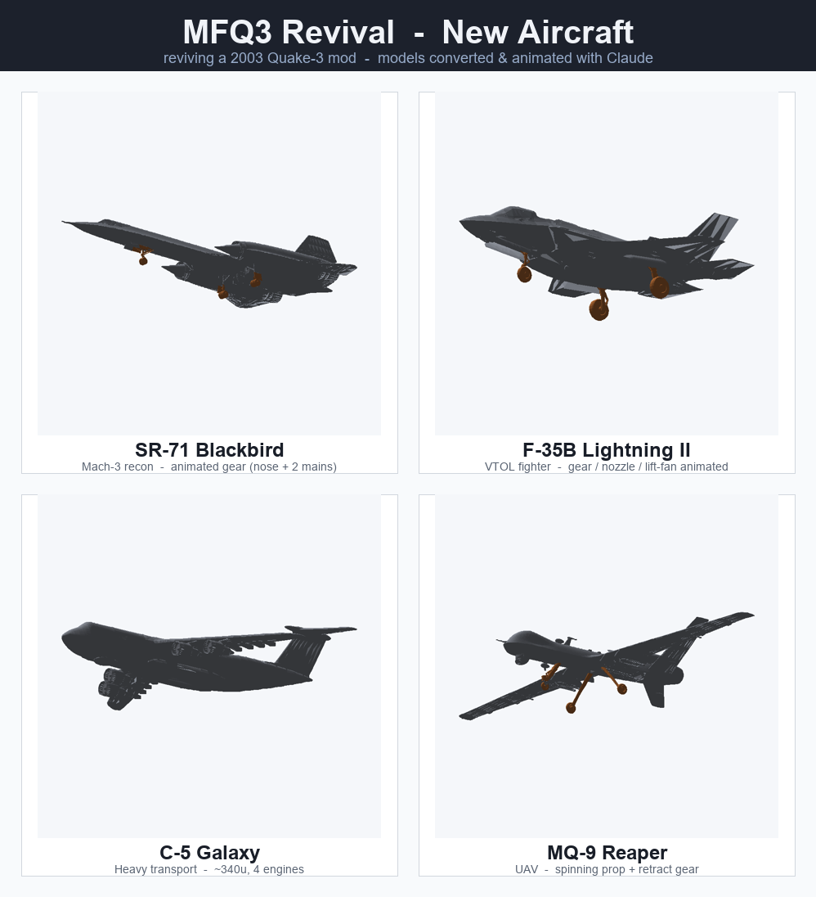
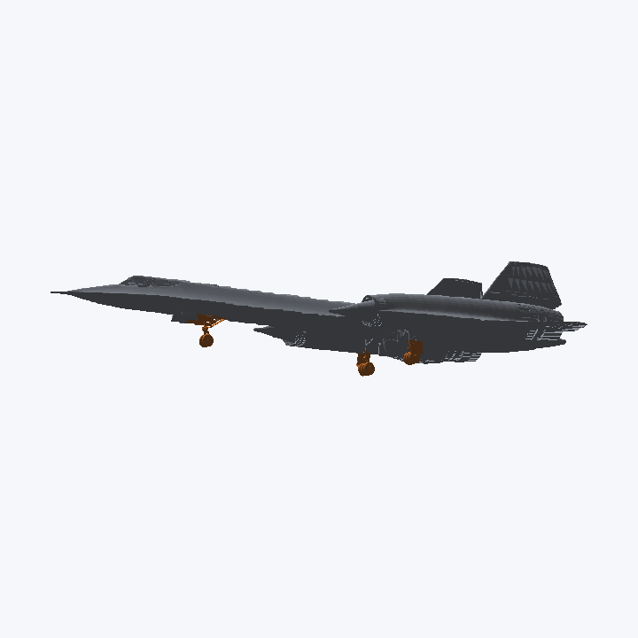
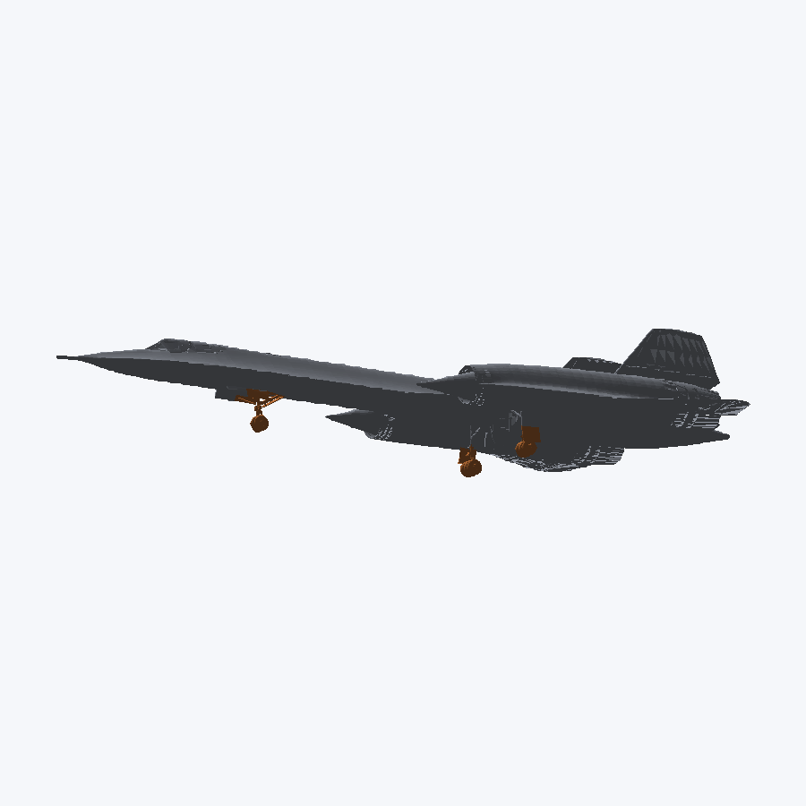
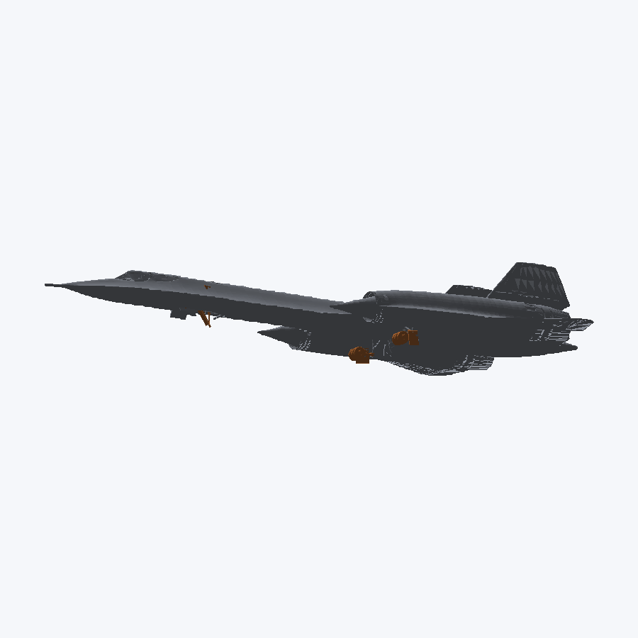

# MFQ3 Revival — Aircraft Showcase

Models converted from free CC-BY glTF/OBJ sources into Quake-3 MD3 and wired into
the mod, with animated parts. See [/CREDITS.md](../../CREDITS.md) for attributions.

## SR-71 gear retract (rendered offline from the MD3)

The SR-71's gear was *merged into the body mesh* — no separate part to grab. It was
isolated by tagging triangles inside per-leg 3D boxes, then built as a 48-frame
retract. Verified without launching the game:

| gear down (frame 47) | gear up (frame 0) |
|---|---|
|  |  |

## The model pipeline (all in `_incoming/`)

| tool | what it does |
|------|--------------|
| `glb2obj.py` | GLB → OBJ, bakes the glTF node-tree world transforms |
| `extract_glb_tex.py` | pulls per-material baseColor textures → JPGs (≤512, solid-color fallback) |
| `render_obj.py` | TOP/SIDE/FRONT ortho silhouettes of an OBJ |
| `render_groups.py` | each OBJ group in a distinct colour (find gear vs engines vs canopy) |
| `analyze_obj.py` | 3D PCA → exact `obj2md3 -Yaw/-Pitch/-Roll` to orient a model |
| `preprocess_gear.py` | tag gear triangles by 3D box into `GEAR_*` groups (for merged-gear models) |
| `obj2md3.ps1` | OBJ → MD3: per-material surfaces, yaw/pitch/roll, animated gear/prop/VTOL parts |
| `render_md3.py` | **offline MD3 viewer** — shade + attach gear at a tag/frame → verify without the game |
| `make_gear_gif.py` | render a gear animation to a GIF (fixed framing) |
| `composite_showcase.py` | the grid above |

**Workflow for a new model:** `glb2obj` → `render_groups`/`analyze_obj` (see what it
is + how to orient) → `extract_glb_tex` → `obj2md3` → `render_md3` to verify → add the
vehicle entry → build. Catching what a model actually contains *before* converting is
the lesson from the C-5 (no gear) and the SR-71 (gear merged into the body).
